# RetailPulse

> Smart Retail Order & Inventory Analytics Platform

RetailPulse is a modern Inventory and Order Management System developed using ASP.NET Core MVC, ASP.NET Core Web API, Entity Framework Core, SQL Server, JWT Authentication, Repository Pattern, Service Layer Pattern, SOLID Principles, and MSTest.

The platform helps retail businesses efficiently manage products, suppliers, inventory transactions, orders, and business analytics through a secure, scalable, and maintainable architecture.

---

# Table of Contents

- Overview
- Business Problem
- Project Objectives
- Key Features
- Technology Stack
- System Architecture
- Project Structure
- Database Design
- Authentication & Authorization
- Frontend and Backend Connectivity
- Business Rules
- Design Patterns Used
- OOP Principles Applied
- SOLID Principles Applied
- Dashboard Features
- API Documentation
- Unit Testing
- DevOps Assets
- AI Assistance
- Installation Guide
- Running the Application
- Screenshots
- Future Enhancements
- Live Application Comparison
- Author

---

# Overview

RetailPulse is a centralized retail operations platform that enables businesses to manage inventory, suppliers, products, stock movements, and customer orders while providing business insights through an analytics dashboard.

The application follows a layered architecture using ASP.NET Core technologies and modern software engineering best practices.

---

# Business Problem

Retail businesses frequently face challenges such as:

- Manual inventory tracking
- Inaccurate stock levels
- Delayed order processing
- Lack of inventory visibility
- Limited supplier management
- Insufficient reporting capabilities
- Data inconsistencies

RetailPulse addresses these challenges through a centralized and secure inventory management platform.

---

# Project Objectives

The primary objectives of RetailPulse are:

- Manage products efficiently
- Manage categories and suppliers
- Track inventory transactions
- Process customer orders
- Generate business reports
- Monitor stock levels
- Provide dashboard analytics
- Implement secure authentication
- Implement role-based authorization
- Apply modern software engineering practices
- Implement RESTful APIs
- Perform unit testing

---

# Key Features

## Authentication & Security

- JWT Authentication
- Role-Based Authorization
- Secure Login
- Protected API Endpoints
- Session Management

Supported Roles:

- Admin
- Manager
- Staff

---

## Dashboard Analytics

The dashboard provides:

- Total Products
- Total Categories
- Total Suppliers
- Total Orders
- Total Revenue
- Low Stock Alerts
- Sales Trend Analysis
- Category Distribution Analysis
- Inventory Summary
- Recent Inventory Transactions

---

## Category Management

Features:

- Add Category
- Edit Category
- Delete Category
- View Categories
- Search Categories

---

## Supplier Management

Features:

- Add Supplier
- Edit Supplier
- Delete Supplier
- View Suppliers

---

## Product Management

Features:

- Add Product
- Edit Product
- Delete Product
- Product Search
- Category Mapping
- Supplier Mapping
- Inventory Tracking

---

## Inventory Management

Features:

- Stock In
- Stock Out
- Inventory Transaction History
- Low Stock Monitoring
- Inventory Analytics

---

## Order Management

Features:

- Create Orders
- View Orders
- Delete Orders
- Revenue Tracking

---

## Reporting Module

Features:

- Sales Reports
- Inventory Reports
- Dashboard Reports
- Revenue Analytics

---

# Technology Stack

## Frontend

- ASP.NET Core MVC (.NET 8)
- Razor Views
- Bootstrap 5
- SB Admin Template
- HTML5
- CSS3
- JavaScript
- Chart.js

## Backend

- ASP.NET Core Web API (.NET 8)
- C#
- RESTful API Architecture

## Database

- SQL Server
- Entity Framework Core
- EF Core Migrations
- Code First Approach

## Security

- JWT Authentication
- Role-Based Authorization

## Testing

- MSTest
- Moq

## Version Control

- Git
- GitHub

## DevOps

- GitHub Actions
- Docker

---

# System Architecture

RetailPulse follows a layered architecture pattern.

```text
Users
   │
   ▼
ASP.NET Core MVC Frontend
   │
   ▼
ASP.NET Core Web API
   │
   ▼
Service Layer
   │
   ▼
Repository Layer
   │
   ▼
Entity Framework Core
   │
   ▼
SQL Server Database
```

### Architecture Benefits

- Separation of Concerns
- Scalability
- Maintainability
- Reusability
- Testability
- Security

---

# Project Structure

```text
RetailOrderInventoryAnalytics
│
├── RetailOrderInventoryAnalytics.API
│
├── RetailOrderInventoryAnalytics.MVC
│
├── RetailOrderInventoryAnalytics.Tests
│
├── .github
│   └── workflows
│       └── dotnet.yml
│
├── AI Assets
│   └── CopilotPromptLog.txt
│
├── Dockerfile
│
└── RetailOrderInventoryAnalytics.sln
```

---

# API Project Structure

```text
RetailOrderInventoryAnalytics.API
│
├── Controllers
│   ├── AuthController.cs
│   ├── CategoryController.cs
│   ├── SupplierController.cs
│   ├── ProductController.cs
│   ├── InventoryController.cs
│   ├── OrderController.cs
│   ├── DashboardController.cs
│   ├── ReportsController.cs
│
├── Data
│   ├── ApplicationDbContext.cs
│   └── DbSeeder.cs
│
├── Models
│   │
│   ├── Entities
│   │   ├── User.cs
│   │   ├── Role.cs
│   │   ├── Category.cs
│   │   ├── Supplier.cs
│   │   ├── Product.cs
│   │   ├── InventoryTransaction.cs
│   │   ├── Order.cs
│   │   ├── OrderItem.cs
│   │   ├── SalesForecast.cs
│   │   └── AuditLog.cs
│   │
│   ├── DTOs
│   │   ├── LoginDto.cs
│   │   ├── RegisterDto.cs
│   │   ├── UserDto.cs
│   │   ├── CategoryDto.cs
│   │   ├── SupplierDto.cs
│   │   ├── ProductDto.cs
│   │   ├── OrderDto.cs
│   │   ├── InventoryTransactionDto.cs
│   │   └── SalesForecastDto.cs
│   │
│   └── ViewModels
│
├── Repositories
│   │
│   ├── Interfaces
│   │   ├── IUserRepository.cs
│   │   ├── ICategoryRepository.cs
│   │   ├── ISupplierRepository.cs
│   │   ├── IProductRepository.cs
│   │   ├── IInventoryRepository.cs
│   │   ├── IOrderRepository.cs
│   │   └── IAuditRepository.cs
│   │
│   ├── UserRepository.cs
│   ├── CategoryRepository.cs
│   ├── SupplierRepository.cs
│   ├── ProductRepository.cs
│   ├── InventoryRepository.cs
│   ├── OrderRepository.cs
│   └── AuditRepository.cs
│
├── Services
│   │
│   ├── Interfaces
│   │   ├── IAuthService.cs
│   │   ├── ICategoryService.cs
│   │   ├── ISupplierService.cs
│   │   ├── IProductService.cs
│   │   ├── IInventoryService.cs
│   │   ├── IOrderService.cs
│   │   ├── IReportService.cs
│   │   ├── IForecastService.cs
│   │   └── IDashboardService.cs
│   │
│   ├── AuthService.cs
│   ├── CategoryService.cs
│   ├── SupplierService.cs
│   ├── ProductService.cs
│   ├── InventoryService.cs
│   ├── OrderService.cs
│   ├── ReportService.cs
│   ├── ForecastService.cs
│   └── DashboardService.cs
│
├── Helpers
│   ├── JwtHelper.cs
│   ├── PasswordHelper.cs
│
├── Middleware
│   └── ExceptionMiddleware.cs
│
├── Mappings
│   └── MappingProfile.cs
│
├── Reports
│   ├── PdfReportGenerator.cs
│   └── ExcelReportGenerator.cs
│
├── Migrations
│
├── appsettings.json
├── appsettings.Development.json
└── Program.cs
```

---

# MVC Project Structure

```text
RetailOrderInventoryAnalytics.MVC
│
├── Controllers
│   ├── AccountController.cs
│   ├── DashboardController.cs
│   ├── CategoryController.cs
│   ├── SupplierController.cs
│   ├── ProductController.cs
│   ├── InventoryController.cs
│   ├── OrderController.cs
│   └── ReportsController.cs
│
├── Models
│   ├── LoginViewModel.cs
│   ├── RegisterViewModel.cs
│   ├── CategoryViewModel.cs
│   ├── SupplierViewModel.cs
│   ├── ProductViewModel.cs
│   ├── OrderViewModel.cs
│   ├── DashboardViewModel.cs
│   └── ForecastViewModel.cs
│
├── Services
│   ├── ApiService.cs
│   ├── AuthApiService.cs
│   ├── ProductApiService.cs
│   ├── CategoryApiService.cs
│   ├── SupplierApiService.cs
│   ├── InventoryApiService.cs
│   ├── OrderApiService.cs
│   └── ReportApiService.cs
│
├── Views
│   │
│   ├── Account
│   │   ├── Login.cshtml
│   │   └── Register.cshtml
│   │
│   ├── Dashboard
│   │   └── Index.cshtml
│   │
│   ├── Category
│   │   ├── Index.cshtml
│   │   ├── Create.cshtml
│   │   ├── Edit.cshtml
│   │   └── Details.cshtml
│   │
│   ├── Supplier
│   │   ├── Index.cshtml
│   │   ├── Create.cshtml
│   │   ├── Edit.cshtml
│   │   └── Details.cshtml
│   │
│   ├── Product
│   │   ├── Index.cshtml
│   │   ├── Create.cshtml
│   │   ├── Edit.cshtml
│   │   └── Details.cshtml
│   │
│   ├── Inventory
│   │   └── Index.cshtml
│   │
│   ├── Order
│   │   ├── Index.cshtml
│   │   ├── Create.cshtml
│   │   └── Details.cshtml
│   │
│   ├── Reports
│   │   └── Index.cshtml
│   │
│   └── Shared
│       ├── _Layout.cshtml
│       ├── _ValidationScriptsPartial.cshtml
│       └── Error.cshtml
│
├── wwwroot
│   ├── css
│   ├── js
│   ├── images
│   └── lib
│
├── appsettings.json
└── Program.cs
```

---

# Test Project Structure

```text
RetailOrderInventoryAnalytics.Tests
│
├── Controllers
│   ├── AuthControllerTests.cs
│   ├── ProductControllerTests.cs
│   ├── CategoryControllerTests.cs
│   └── SupplierControllerTests.cs
│
├── Services
│   ├── AuthServiceTests.cs
│   ├── ProductServiceTests.cs
│   ├── CategoryServiceTests.cs
│   ├── SupplierServiceTests.cs
│   └── InventoryServiceTests.cs
│
├── Repositories
│   ├── ProductRepositoryTests.cs
│   ├── CategoryRepositoryTests.cs
│   └── SupplierRepositoryTests.cs
│
├── TestHelpers
│   ├── MockData.cs
│   └── TestDbContextFactory.cs
│
└── Usings.cs
```

---

# Database Design

## Users

Stores authentication and role information.

Fields:

- UserId
- Username
- Email
- PasswordHash
- Role

---

## Categories

Stores category information.

Fields:

- CategoryId
- CategoryName
- Description

---

## Suppliers

Stores supplier information.

Fields:

- SupplierId
- SupplierName
- ContactNumber
- Email

---

## Products

Stores product details.

Fields:

- ProductId
- ProductName
- CategoryId
- SupplierId
- Price
- QuantityInStock

---

## Orders

Stores customer order information.

Fields:

- OrderId
- OrderDate
- TotalAmount

---

## InventoryTransactions

Stores inventory movement history.

Fields:

- TransactionId
- ProductId
- TransactionType
- Quantity
- TransactionDate

---

# Entity Relationships

```text
Category (1)
      │
      └──────► Product (Many)

Supplier (1)
      │
      └──────► Product (Many)

Product (1)
      │
      └──────► InventoryTransaction (Many)
```

---

# Authentication & Authorization

## Authentication Flow

```text
User Login
    │
    ▼
Credential Validation
    │
    ▼
JWT Token Generation
    │
    ▼
Token Returned
    │
    ▼
Protected API Access
```

---

## Authorization

Roles Supported:

- Admin
- Manager
- Staff

Role-based access is enforced across the application.

---

# Frontend and Backend Connectivity

```text
User
 │
 ▼
MVC View
 │
 ▼
MVC Controller
 │
 ▼
MVC Service
 │
 ▼
Web API
 │
 ▼
Service Layer
 │
 ▼
Repository Layer
 │
 ▼
Entity Framework Core
 │
 ▼
SQL Server
```

---

# Business Rules

The following business rules are implemented:

1. Only authenticated users can access protected modules.
2. Users are assigned roles.
3. Categories must exist before products can be created.
4. Suppliers must exist before products can be created.
5. Product names are mandatory.
6. Product prices must be valid.
7. Inventory quantities cannot become negative.
8. Inventory transactions update stock levels.
9. Orders require valid products.
10. Dashboard analytics are generated from business data.

---

# Design Patterns Used

## Repository Pattern

Repositories:

- UserRepository
- CategoryRepository
- SupplierRepository
- ProductRepository
- OrderRepository
- InventoryRepository

Purpose:

- Data Access Abstraction
- Loose Coupling
- Maintainability

---

## Service Layer Pattern

Services:

- AuthService
- CategoryService
- SupplierService
- ProductService
- OrderService
- InventoryService

Purpose:

- Business Logic Separation
- Reusability
- Clean Architecture

---

# OOP Principles Applied

## Encapsulation

Implemented through entity classes.

## Abstraction

Implemented using interfaces.

## Inheritance

Implemented through MVC and API controller inheritance.

## Polymorphism

Implemented through interface implementations.

---

# SOLID Principles Applied

## Single Responsibility Principle

Controllers, Services, and Repositories have separate responsibilities.

## Open Closed Principle

Implemented using interfaces and abstractions.

## Liskov Substitution Principle

Interface implementations are interchangeable.

## Interface Segregation Principle

Small focused interfaces are used.

## Dependency Inversion Principle

Implemented using Dependency Injection.

---

# Dashboard Features

The Dashboard includes:

- Total Products KPI
- Total Categories KPI
- Total Suppliers KPI
- Total Orders KPI
- Total Revenue KPI
- Low Stock Alerts
- Category Distribution Chart
- Sales Trend Chart
- Inventory Analytics
- Recent Inventory Transactions

---

# API Documentation

## Authentication APIs

```http
POST /api/auth/login
POST /api/auth/register
```

## Category APIs

```http
GET    /api/category
GET    /api/category/{id}
POST   /api/category
PUT    /api/category/{id}
DELETE /api/category/{id}
```

## Supplier APIs

```http
GET    /api/supplier
POST   /api/supplier
PUT    /api/supplier/{id}
DELETE /api/supplier/{id}
```

## Product APIs

```http
GET    /api/product
POST   /api/product
PUT    /api/product/{id}
DELETE /api/product/{id}
```

## Inventory APIs

```http
GET    /api/inventory
POST   /api/inventory
```

## Order APIs

```http
GET    /api/order
POST   /api/order
DELETE /api/order/{id}
```

---

# Unit Testing

Testing Framework:

- MSTest

Mocking Framework:

- Moq

Test Cases:

1. Login with Valid Credentials
2. Login with Invalid Credentials
3. GetAllCategoriesAsync
4. AddCategoryAsync
5. DeleteCategoryAsync
6. AddSupplierAsync
7. GetAllSuppliersAsync
8. AddProductAsync
9. GetProductByIdAsync
10. AddInventoryTransactionAsync
11. CreateOrderAsync
12. DeleteOrderAsync
13. Validation Test Cases

Result:

```text
Passed : 13
Failed : 0
```

---

# DevOps Assets

## GitHub Actions

File:

```text
.github/workflows/dotnet.yml
```

Pipeline Tasks:

- Restore Packages
- Build Solution
- Execute Unit Tests

---

## Docker Support

File:

```text
Dockerfile
```

Purpose:

- Containerized Deployment
- Environment Consistency
- Portability

---


# Installation Guide

## Clone Repository

```bash
git clone <repository-url>
```

## Restore Packages

```bash
dotnet restore
```

## Apply Migrations

```powershell
Update-Database
```

## Run API Project

```bash
dotnet run --project RetailOrderInventoryAnalytics.API
```

## Run MVC Project

```bash
dotnet run --project RetailOrderInventoryAnalytics.MVC
```

---

# Screenshots

## System Architecture Diagram

The application follows a layered architecture consisting of MVC Frontend, Web API, Service Layer, Repository Layer, Entity Framework Core, and SQL Server.

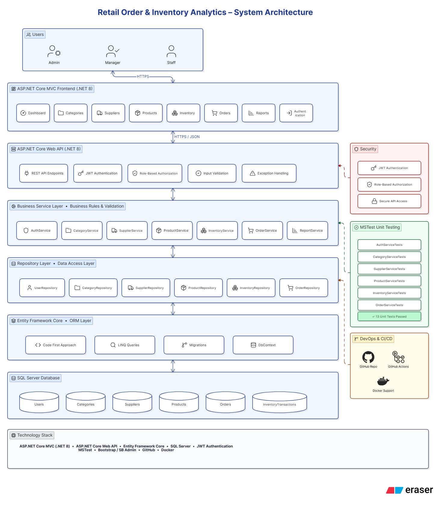

---

## Entity Relationship Diagram (ER Diagram)

The database design illustrates the relationships between Users, Categories, Suppliers, Products, Orders, and Inventory Transactions.

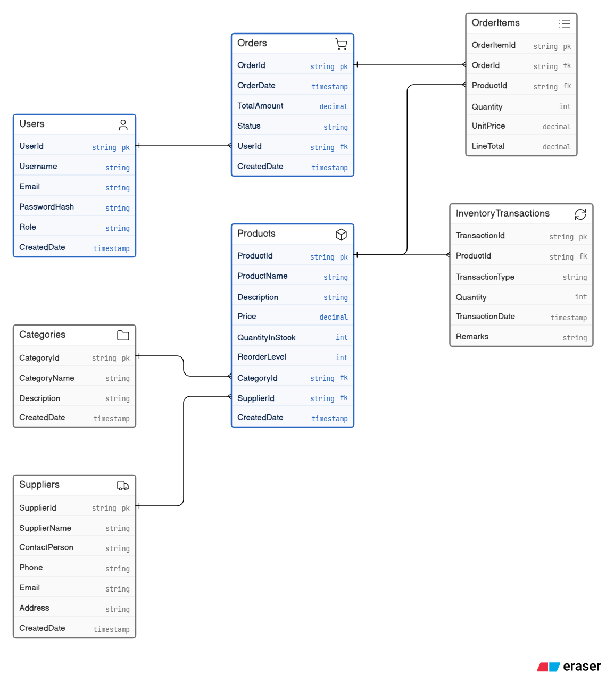

---

## Login Page

The Login module provides secure access to the application using JWT Authentication.

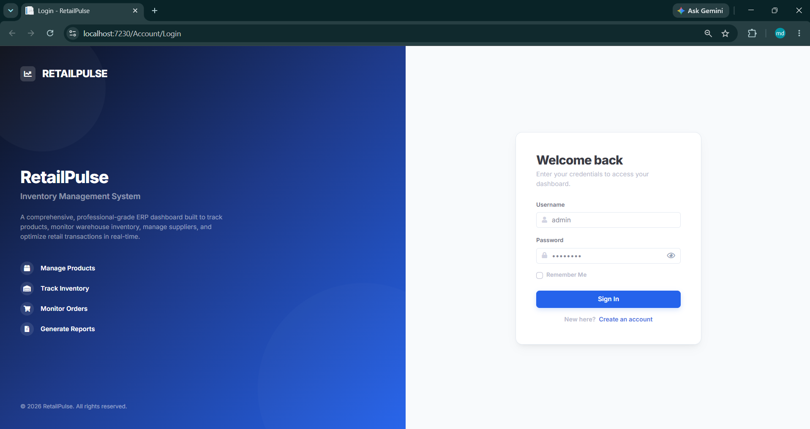

---

## Register Page

The Registration module allows new users to create accounts and access the platform.


---

## Dashboard

The Dashboard provides real-time business analytics and inventory insights.

Features:

- Total Products
- Total Categories
- Total Suppliers
- Total Orders
- Total Revenue
- Low Stock Alerts
- Sales Analytics
- Inventory Analytics

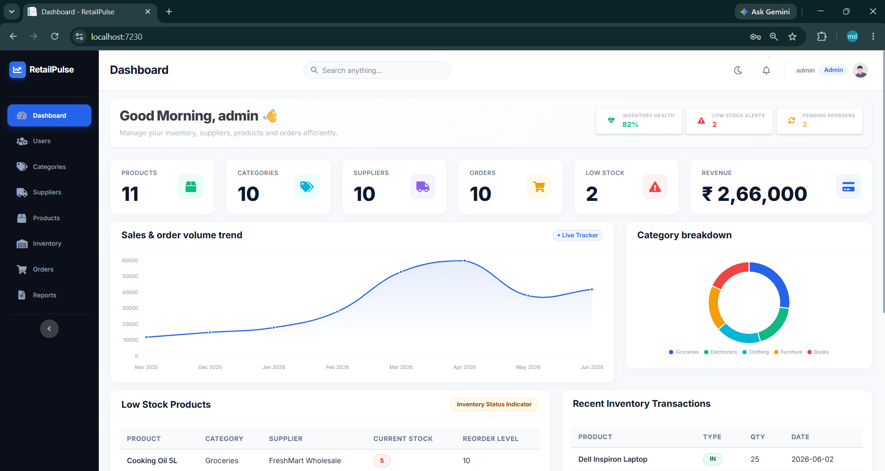

---

## Category Management

The Category Management module allows administrators to manage product categories.

Features:

- Add Category
- Edit Category
- Delete Category
- Search Categories

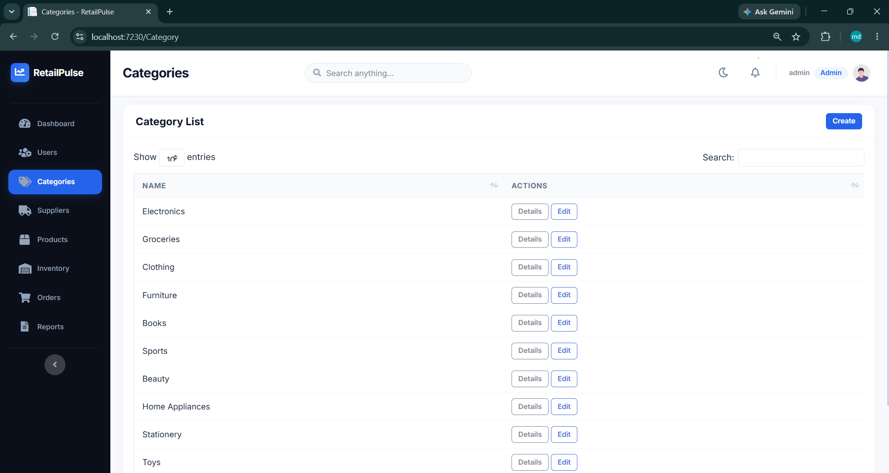

---

## Supplier Management

The Supplier Management module manages supplier information and contact details.

Features:

- Add Supplier
- Edit Supplier
- Delete Supplier
- View Suppliers

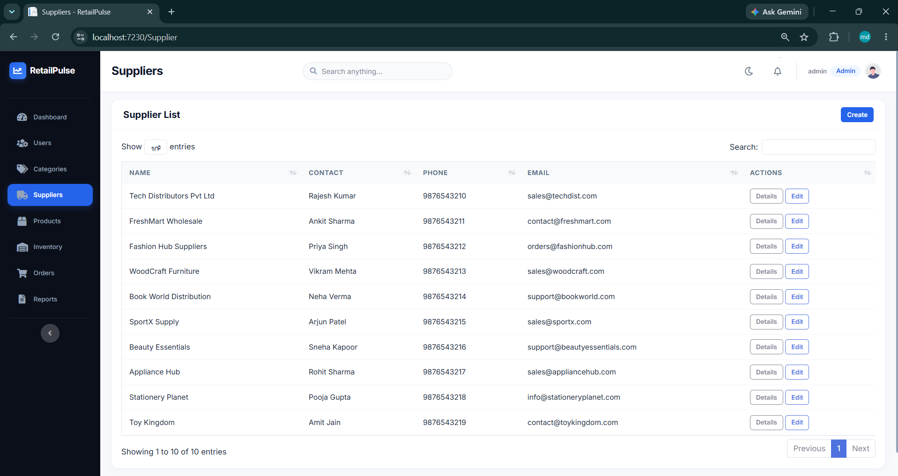

---

## Product Management

The Product Management module manages inventory products.

Features:

- Add Product
- Edit Product
- Delete Product
- Assign Categories
- Assign Suppliers
- Manage Stock

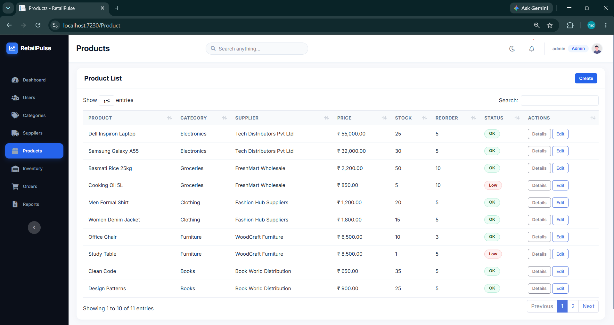

---

## Inventory Management

The Inventory module tracks stock movement and inventory transactions.

Features:

- Stock In
- Stock Out
- Inventory History
- Transaction Tracking

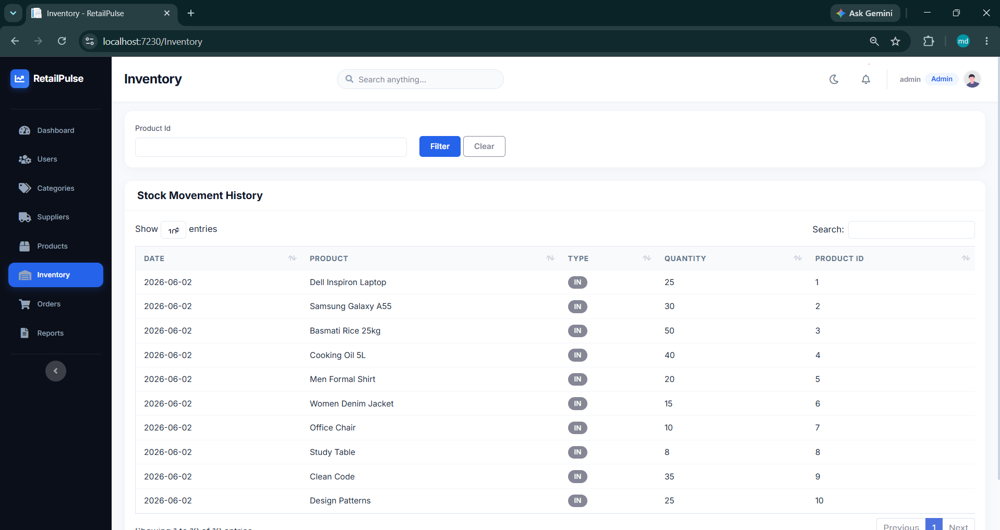

---

## Order Management

The Order module manages customer orders and revenue tracking.

Features:

- Create Orders
- View Orders
- Delete Orders
- Revenue Monitoring

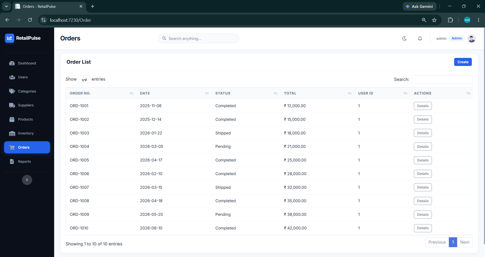

---

## Reports Module

The Reports module provides business insights and inventory analytics.

Features:

- Sales Reports
- Inventory Reports
- Revenue Analytics
- Dashboard Reports

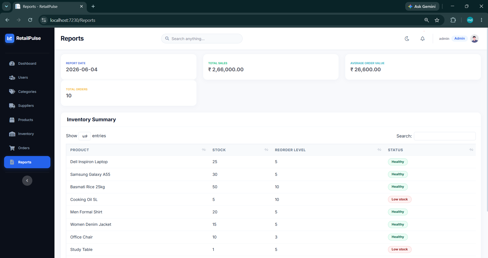

---

## Swagger API Documentation

Swagger provides interactive API documentation and endpoint testing.

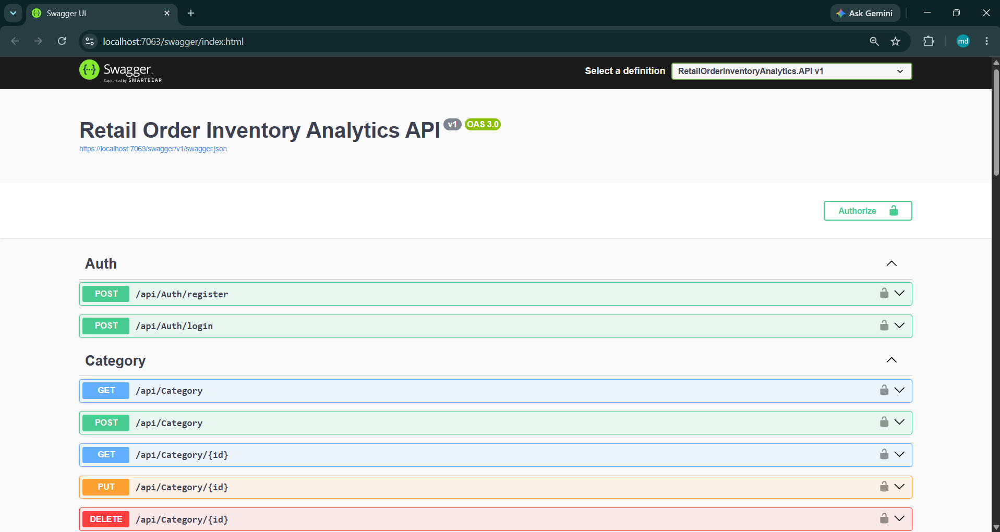

---

# Project Workflow

```text
User
 │
 ▼
ASP.NET Core MVC Frontend
 │
 ▼
ASP.NET Core Web API
 │
 ▼
Service Layer
 │
 ▼
Repository Layer
 │
 ▼
Entity Framework Core
 │
 ▼
SQL Server Database
```

---

# Application Flow

1. User logs into RetailPulse.
2. JWT token is generated after successful authentication.
3. Dashboard loads business analytics.
4. Categories, Suppliers, and Products are managed.
5. Inventory transactions update stock levels.
6. Orders are processed and recorded.
7. Reports and analytics are generated.
8. Dashboard reflects real-time business metrics.

# Future Enhancements

- Email Notifications
- Excel Export
- PDF Export
- SignalR Notifications
- AI-Based Sales Forecasting
- Cloud Deployment (Azure)
- Mobile Application
- Multi-Store Inventory Management
- Barcode Integration
- QR Code Integration

---

# Live Application Comparison

RetailPulse follows concepts used in:

- Zoho Inventory
- Odoo Inventory
- Oracle NetSuite
- SAP Inventory Management

Implemented Features:

✅ Product Management

✅ Supplier Management

✅ Inventory Tracking

✅ Order Management

✅ Dashboard Analytics

✅ Authentication

✅ Authorization

Future Enterprise Features:

- ERP Integration
- Multi-Warehouse Support
- AI Forecasting
- Real-Time Notifications

---

# Author

**RetailPulse**

Retail Order & Inventory Analytics Platform

Built using ASP.NET Core MVC, ASP.NET Core Web API, Entity Framework Core, SQL Server, JWT Authentication, Repository Pattern, SOLID Principles, MSTest, GitHub Actions, and Docker.
